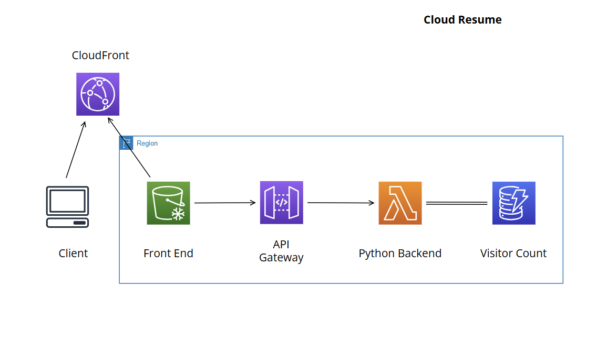

# Cloud Resume Challenge

This project is part of the Cloud Resume Challenge and showcases my skills in cloud engineering and development. The goal of this challenge is to create a personal, interactive resume hosted entirely on the cloud.

## Table of Contents
- [Project Overview](#project-overview)
- [Architecture](#architecture)
- [Technologies Used](#technologies-used)
- [Challenges](#challenges)
- [Future Improvements](#future-improvements)

## Project Overview
The Cloud Resume Challenge requires participants to design and deploy a serverless, cloud-based resume website that includes:
- A static resume website hosted on an S3 bucket
- A DynamoDB table to track visitor count
- An API Gateway to expose a visitor counter API
- A Lambda function to interact with DynamoDB and handle visitor counting
- CI/CD pipelines for frontend updates

My resume website is deployed on an S3 bucket with a CloudFront distribution for optimized delivery. The website also includes a visitor counter that updates dynamically using API Gateway, DynamoDB, and Lambda.

## Architecture

### Components:
1. **Frontend**: A static website (HTML, CSS, JavaScript) hosted on an S3 bucket.
2. **Backend**: A Python-based Lambda function for the visitor counter, connecting to DynamoDB through API Gateway.
3. **Infrastructure**: Provisioned and managed using Terraform, including S3, CloudFront, DynamoDB, Lambda, and API Gateway.
4. **CI/CD**: GitHub Actions are configured for automated deployment of the frontend files to S3 and backend code to Lambda.

## Technologies Used
- **Frontend**: HTML, CSS, JavaScript
- **Backend**: Python, AWS Lambda, API Gateway
- **Database**: DynamoDB
- **Infrastructure as Code**: Terraform
- **CI/CD**: GitHub Actions

## Future Improvements
- Add unit tests for the Lambda function to validate functionality.
- Enhance the CI/CD pipeline by automating the deployment of the backend
- Implement additional features, such as form submissions or portfolio sections.

## Contact
For questions, feel free to reach out via [LinkedIn](https://linkedin.com/in/nishanthprem).